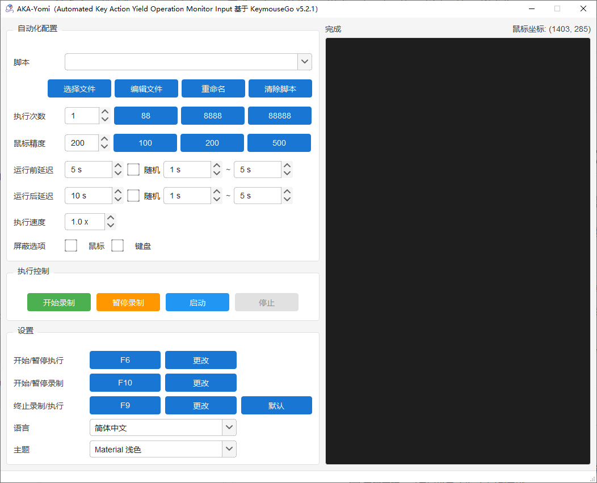

<div align="center">

# AKA-Yomi

<br>



<br>

<div>
    
    
    
</div>
<br>

[简体中文](README.md) | [English](README_en-US.md)

</div>

## Introduction

AKA-Yomi is a mouse and keyboard automation tool rebuilt based on [KeymouseGo](https://github.com/taojy123/KeymouseGo), focusing on user experience optimization for the Windows platform.

Features: Record user's mouse and keyboard operations, automatically execute previously recorded operations via trigger buttons, with configurable execution times, pre/post delays, and random delay ranges. It can be regarded as a `simplified green version` of `Quick Macro`.

Usage: When performing simple, monotonous, and repetitive tasks, this software can save you a lot of effort. Just do it once yourself, and then let the computer handle the rest.

> **Development Note**: The author has no coding background. This project was developed through secondary development using [TRAE SOLO](https://www.trae.ai/), with all modifications completed through pure Chinese communication.

## Key Features

- 🌍 **Multi-language Support**: 简体中文 / English / 繁體中文
- 🎨 **Theme System**: Material Light, Material Dark, Bootstrap, Glassmorphism, Cartoon, Geek, and more
- ⏱️ **Delay Control**: Pre-run and post-run delays, with optional random delay ranges
- 🛑 **Stop Button**: Stop recording or execution at any time
- 📁 **File Management**: One-click open script folder, rename, edit, and clear scripts
- ⌨️ **Hotkey Support**: Customizable start/stop/record hotkeys
- 🔧 **Plugin System**: Support for custom plugins to extend functionality

## Download & Usage

### Direct Download (Recommended)

Go to the [Releases](https://github.com/Leo-WIT/AKA-Yomi/releases) page to download the latest `AKA-Yomi.exe`, double-click to run.

> All runtime files (config, scripts, logs) are stored in the system temp directory `%TEMP%\KeymouseGo\`, no files are generated in the exe's directory.

### Run from Source

```bash
# 1. Clone the repository
git clone https://github.com/Leo-WIT/AKA-Yomi.git
cd AKA-Yomi

# 2. Install dependencies
pip install -r requirements-windows.txt

# 3. Run
python KeymouseGo.py
```

### Build Executable

```bash
# Install pyinstaller
pip install pyinstaller

# Build (Windows)
pyinstaller -Fw --add-data "assets;assets" --icon "Mondrian.ico" --name "AKA-Yomi" KeymouseGo.py
```

The executable will be located at `dist/AKA-Yomi.exe`.

## User Guide

### Interface

| Area | Function |
|------|----------|
| Execution Control | Start Record / Pause Record / Launch / Stop |
| Script List | Select script to execute |
| File Management | Open folder / Edit / Rename / Clear scripts |
| Execution Settings | Loop times, pre/post delays, random delays |
| Recording Settings | Mouse/Keyboard recording toggle |
| Theme Settings | Switch interface theme |
| Language Settings | Switch interface language |
| Hotkey Settings | Customize start/stop/record hotkeys |

### Basic Operations

1. **Record Script**
   - Click the `Start Record` button
   - Perform mouse clicks, keyboard inputs, etc.
   - Click the `Finish Recording` button to end
   - Script is automatically saved to the script folder

2. **Execute Script**
   - Select the script to execute from the list
   - Set loop times (0 for infinite loop)
   - Optional: Set pre/post delays
   - Click the `Launch` button to start

3. **Stop Operation**
   - Click `Stop` during recording: Confirm whether to abandon the current recording
   - Click `Stop` during execution: Immediately terminate script execution

### Hotkeys

- **Start Hotkey**: Default `F6`, same as clicking the `Launch` button
- **Stop Hotkey**: Default `F9`, same as clicking the `Stop` button
- **Record Hotkey**: Default `F10`, same as clicking the `Start Record` button

### Tips

1. Set loop times to `0` for infinite loop.
2. Only mouse clicks and keyboard operations are recorded, mouse movement trails are not.
3. A new script file is generated in the script folder after each recording.
4. You can select a script to run from the list before execution.
5. In hotkey settings, `Middle` refers to the mouse middle button, `XButton` refers to the mouse side button.
6. Due to program speed limitations, the running speed cannot be set too high.
7. In some system environments, mouse events may not be fully recorded. Run this tool as administrator to resolve this.

## Script Syntax

Scripts are in `json5` format, with each event representing an operation:

```json5
{
  scripts: [
    // After 3000ms, press the right mouse button at relative coordinates (0.05208, 0.1852) i.e. (100,200)
    {type: "event", event_type: "EM", delay: 3000, action_type: "mouse right down", action: ["0.05208%", "0.1852%"]},
    // After 50ms, release the right mouse button at the same position
    {type: "event", event_type: "EM", delay: 50, action_type: "mouse right up", action: [-1, -1]},
    // After 1000ms, press the F key
    {type: "event", event_type: "EK", delay: 1000, action_type: "key down", action: [70, 'F', 0]},
    // After 50ms, release the F key
    {type: "event", event_type: "EK", delay: 50, action_type: "key up", action: [70, 'F', 0]},
    // After 100ms, input text
    {type: "event", event_type: "EX", delay: 100, action_type: "input", action: "Hello world"}
  ]
}
```

## Tech Stack

- Python 3.10+
- PySide6 (Qt UI)
- pynput (Mouse/Keyboard recording)
- pyautogui (Mouse/Keyboard execution)
- qt-material (Theme system)
- loguru (Logging)

## License

This project is open-sourced under the [GNU GPLv3](LICENSE) license.

## Acknowledgements

This project is a secondary development based on [KeymouseGo](https://github.com/taojy123/KeymouseGo). Thanks to the original author for their contribution.
